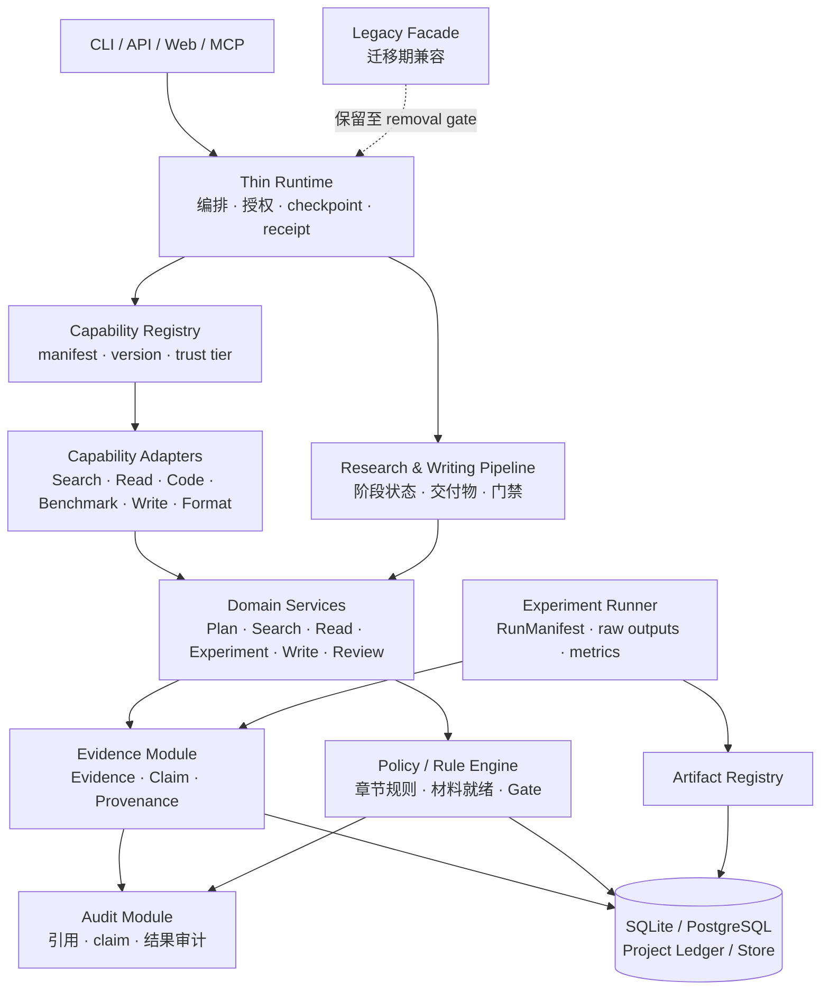

# 红枫 AutoResearch 架构与协作手册（团队评审版）

> 状态：`team-review draft / non-authoritative`
>
> 日期：2026-09-04
>
> 用途：给团队成员和 AI 的统一阅读入口，说明整个 AutoResearch 的产品目标、目标架构、论文生成流水线、阶段路线、协作方式和验收规则。
>
> 权威说明：本文是可读性入口，不取代现有架构和项目账本。当前目标架构以 `docs/rearchitecture/R004-trust-program/` 为准，S1 实现以 R003 为准，S1 收口设计以 R005 为准。

---

## 1. 项目目标

一条**可配置、可追溯、可验证的论文研究与写作流水线**。

首要用户场景：

- 本科和研究生的课程设计报告；
- 本科毕业论文；
- 研究生课程论文、开题和实验报告。

后续场景：

- 期刊论文；
- 会议论文；
- related work、综述和更复杂的科研工作流。

红枫的核心差异不是重新实现所有科研工具，而是：

```text
外部工具负责“做事”
红枫负责“组织、追踪、验证和审计”
```

系统不承诺：

- 研究问题必然新颖；
- 实验必然成功；
- 论文必然录用；
- Agent 可以替代导师或作者做最终学术判断。

系统承诺的是：

- 关键 claim 有来源和定位；
- 未验证内容不会伪装成已验证；
- 未执行实验不会伪装成实验结果；
- 缺少材料时明确阻断或列出缺口；
- 每个阶段的输入、输出、状态和责任都可追溯。

## 2. 架构方法

**“薄 Runtime + 可替换 Capability + 领域流水线 + 独立信任层 + 项目账本”**。

- Runtime 负责编排、授权、checkpoint 和 receipt；
- Capability 通过 Native、MCP、Skill 或外部服务接入；
- Domain Services 负责搜索、阅读、实验、写作和审阅；
- Evidence / Policy / Audit 负责事实、规则和复核；
- Project Ledger / Store 保存项目、运行、证据、artifact 和决策；
- 先设计全局架构，再用一条真实纵向切片验证，不一次性重写全部模块。

## 3. 全局 L1 架构



### 3.1 L1 子系统职责

| 子系统 | 负责 | 不负责 |
|---|---|---|
| 入口层 | 接收请求、展示状态、提供受控 API | 业务编排、证据写入、最终判断 |
| Thin Runtime | run、授权、调度、checkpoint、receipt、恢复入口 | 搜索算法、写 Evidence、修改 GateDecision |
| Capability Registry | 能力名称、版本、权限、trust tier | 执行能力、证明结果正确 |
| Capability Adapter | 外部调用、typed transfer、幂等、显式失败 | 直接写 Evidence、直接做 GateDecision |
| Research Pipeline | 阶段顺序、交付物状态、阶段门禁 | 代替领域服务执行细节 |
| Domain Services | 计划、搜索、阅读、实验、写作、审阅 | 跨边界越权写状态 |
| Evidence Module | Evidence、Claim、Provenance、失效和关联 | 生成论文 prose、做政策判断 |
| Policy / Rule Engine | 规则、章节验证、材料检查、Gate | 创造事实 |
| Experiment Runner | 运行代码/数据/指标、保存原始结果 | 把计划写成结果 |
| Audit Module | 引用、声明、实验结果和一致性审计 | 直接写 EvidenceItem、直接改 GateDecision |
| Store / Ledger | 持久化、项目投影、artifact 索引 | 决定业务语义 |
| Legacy Facade | 迁移期兼容旧入口 | 成为新的事实或规则中心 |

### 3.2 事实和状态的唯一写入者

| 事实 | 唯一权威/写入者 |
|---|---|
| capability manifest/version | Capability Registry |
| run lifecycle/checkpoint | Thin Runtime / Checkpoint Adapter |
| invocation receipt | Runtime（capability invocation idempotency record 需按 ADR-7 最终裁决） |
| PaperRecord / ReadingCard / Manuscript | 对应 Domain Service |
| EvidenceItem / ClaimLink / ArtifactLink | Evidence Module |
| GateDecision | Policy / Gate |
| AuditReport artifact | Audit Module，经 Persistence Port 写入 |
| Project projection | Project Ledger |
| 实验原始输出和 metrics | Experiment Runner / Artifact Registry |

禁止：Agent、Skill、MCP、Adapter 直接写 Evidence 状态或 GateDecision。

## 4. 模块存在形式

模块不等于 Agent。Agent 是业务角色，Search、Evidence、Policy、Store 等也可以是服务。

| 形态 | 说明 |
|---|---|
| Agent | 五个业务角色：orchestrator、search、reader、writer、reviewer |
| Domain Service | 被 Agent 或 Runtime 调用的稳定业务服务 |
| Capability | 可替换的能力来源：native、MCP、Skill、第三方工具 |
| Adapter | 将外部能力转换成内部 typed contract |
| Pipeline Stage | 一次可暂停、可验证、有输入输出的工作阶段 |
| Evidence / Policy / Audit | 可信机制服务，不额外增加业务 Agent |

## 5. L2 模块间协议

跨边界只允许四种交互形式：

```text
Command        请求执行动作
Typed Transfer 传递结构化结果
Query / View   读取有界视图
Receipt / Evidence 传递调用收据或证据事实
```

### 5.1 Pipeline Stage Contract

```text
StageInput → StageExecution → StageOutput + StageReceipt
```

每个 Stage 必须声明：

- 前置 stage 和输入 artifact；
- 输出 artifact 类型；
- 所需 capability；
- 需要的 evidence；
- 可进入的下一状态；
- 失败、取消和恢复方式；
- 是否需要人工确认。

### 5.2 Capability Invocation Contract

输入：

```text
project_id + run_id + invocation_id
+ capability_version + bounded_input
```

输出：

```text
typed_output + diagnostics
+ InvocationReceipt + EvidenceCandidate[]
```

规则：

- reserve 先于外部副作用；
- 相同 invocation identity 和 fingerprint 必须精确 replay；
- 冲突 replay 必须拒绝；
- timeout、provider error、parse error、unknown 必须显式返回；
- 未知结果不能自动变成成功。

### 5.3 Evidence Admission Contract

```text
EvidenceCandidate
  → Evidence Admission
  → EvidenceItem / ClaimLink / ArtifactLink
```

Evidence Module 检查：

- 来源是否存在；
- locator 是否有效；
- candidate 是否重复；
- 是否与既有事实冲突；
- 是否能支持某个 claim；
- 证据等级和适用范围是什么。

### 5.4 Manuscript Section Contract

章节不是普通字符串，而是可验证对象：

```text
SectionDraft {
  section_id
  section_type
  writing_profile
  claims[]
  citations[]
  evidence_refs[]
  experiment_refs[]
  unresolved_items[]
  validation_status
}
```

Writer 可以生成草稿，但不能：

- 新增没有证据的数字；
- 把 planned 写成 observed；
- 删除 unknown、failure 或 limitation；
- 改变 evidence strength；
- 绕过 Rule Engine 的验证结果。

### 5.5 Material Readiness Contract

输入：

```text
paper_type + target_section + experiment_plan + project_state
```

输出：

```text
ready | needs_material | blocked
+ required_materials[]
+ optional_materials[]
+ missing_evidence[]
+ blocking_reasons[]
```

检查对象包括：数据集、baseline、代码、环境、指标、实验结果、图表、引用、locator、失败记录和限制。

### 5.6 Experiment / Benchmark Contract

Benchmark Advisor 只能提出计划和建议：

```text
BenchmarkRequest
  → BenchmarkPlan
  → Material Readiness Check
  → Experiment Runner
```

只有实际执行后才能产生：

```text
RunManifest + RawOutputs + Metrics + ExperimentArtifact
```

未执行的 benchmark 必须保持 `planned`，不能写成实验结果。

### 5.7 Audit / Promotion Contract

输入：稿件、claims、引用和实验 artifact。

输出：

```text
AuditReport + AuditVerdict[] + PromotionDecision
```

结果可以是：

```text
pass / fail / unknown / needs_review
```

`unknown` 必须保留为未知，不能 fail-open。

## 6. 论文生成 Pipeline

### Stage 0：项目受理

输入：用户目标、论文类型、学校/venue 模板、截止时间、可用资源。

输出：`ProjectBrief`、`WritingProfile`、`ConstraintSet`。

门禁：关键信息不足时进入 `needs_material`，不直接生成论文。

### Stage 1：研究问题与计划

```text
用户想法
  → 研究问题
  → 目标/假设
  → 任务拆解
  → 预期证据和实验
```

输出：`ResearchPlan`、初始 claims、风险和未知项。

门禁：目标、范围、评价标准和反证条件必须明确。

### Stage 2：文献检索与筛选

```text
ResearchPlan
  → Search Capability
  → PaperRecord
  → 去重 / 版本归并
  → 纳排筛选
  → ReadingQueue
```

输出：带来源、版本、许可和筛选理由的论文记录。

### Stage 3：阅读与证据抽取

```text
PaperRecord
  → Reader Capability
  → ReadingCard
  → Claim / Method / Dataset / Result
  → Evidence Admission
```

输出：`EvidenceBundle`、`ClaimEvidenceMap`、冲突和未知项。

门禁：关键事实必须有 locator；摘要级证据不能支撑超出其范围的 claim。

### Stage 4：论文结构与章节计划

```text
PaperType + WritingProfile + EvidenceBundle
  → Outline Planner
  → SectionPlan[]
```

每节必须列出：目标、必须回答的问题、允许使用的 claims、所需 evidence、所需实验 artifact 和当前缺口。

### Stage 5：实验与 benchmark 计划

```text
Claims + Method + Dataset + Resources
  → Benchmark Advisor
  → BenchmarkPlan
  → Material Readiness Checker
```

输出：推荐 benchmark、baseline、指标、所需材料、风险和当前不能声称的结论。

### Stage 6：实验执行

```text
BenchmarkPlan
  → Experiment Runner
  → RunManifest
  → RawOutputs
  → Metrics / Figures / Tables
  → Artifact Registry
```

必须记录代码版本、数据版本、环境、参数、随机种子、命令、退出状态、原始输出和异常。

### Stage 7：章节生成

```text
SectionPlan
  + EvidenceBundle
  + ExperimentArtifacts
  + WritingProfile
  → Writer Agent
  → SectionDraft
```

章节生成只消费已允许的 claims、evidence 和结果；没有材料时保留占位符或阻断。

### Stage 8：章节规则验证

```text
SectionDraft
  → Writing Rule Engine
  → SectionValidationReport
```

检查：章节结构、格式、语气、字数、claim-evidence 覆盖、实验结果绑定、引用一致性、未验证声明和禁止新增内容。

输出：`verified`、`revise` 或 `blocked`。

### Stage 9：整稿组装与审计

```text
Verified Sections
  → Manuscript Assembler
  → Whole-Manuscript Audit
  → Release Readiness Report
```

输出：论文工作稿、claim-evidence map、实验材料清单、benchmark 计划/结果、引用审计、未解决问题和限制。

## 7. Pipeline 状态

```text
blocked → ready → running → produced → verified → accepted
                         ├→ failed
                         ├→ unknown
                         └→ needs_material
```

状态规则：

- `blocked`：不满足硬前置条件，不得继续；
- `ready`：输入和权限齐全，可以启动；
- `running`：正在执行，不能重复创建同一副作用；
- `produced`：产生了输出，但还没有通过规则/证据验证；
- `verified`：通过对应阶段验证；
- `accepted`：由阶段 owner 或人工 gate 接纳；
- `failed`：执行失败，必须保留失败原因和原始输出；
- `unknown`：外部结果不确定，不能当成功；
- `needs_material`：缺少材料，但不一定是系统错误。

## 8. 阶段路线

| 阶段 | 目标 | 主要交付 | 当前建议状态 |
|---|---|---|---|
| P0 | 范围、架构、协作和账本统一 | 总手册、L1/L2、文档权威图 | 当前团队反馈阶段 |
| P1 | 验证一条真实论文切片 | Paper Search + Evidence + 一个章节 pipeline | 下一实施重点 |
| P2 | 形成 Evidence / Claim / Audit 闭环 | claim-evidence、引用/声明审计 | 后续 |
| P3 | 实验与材料就绪 | Benchmark Advisor、RunManifest、Readiness Checker | 后续 |
| P4 | 多章节、多论文类型 | WritingProfile、章节规则验证 | 后续 |
| P5 | 外部 Skill/MCP/工具兼容 | 能力注册、版本、trust tier、适配器 | 后续 |
| P6 | 真实论文工作包 | 从问题到可审计论文工作稿的端到端试点 | 后续 |

与现有 R004 的关系：

```text
R004 S0 ≈ P0 治理和基线
R004 S1 ≈ P1 技术基础切片
R004 S2 ≈ P2 Evidence / Audit
R004 S3 ≈ P3/P4 Reader / Writer / 外部能力
R004 S4 ≈ P5/P6 可信闭环和公开 benchmark
```

## 9. 第一阶段建议

第一阶段不建议定义成单独的“Paper Search 产品”，而建议定义为：

```text
P1：证据约束的论文章节生成切片
```

最小范围：

- 一种论文类型；
- 一个章节（优先 Evaluation 或 Related Work）；
- 一个 WritingProfile；
- 一个 benchmark 场景；
- 一套材料检查清单；
- 一套章节规则验证；
- 一条 legacy/target 兼容路径。

其中 Paper Search 仍然是技术基础子任务，负责证明 Capability、Evidence、幂等、parity 和 recovery。

## 10. 当前实现与缺口

当前已有基础：

- 五个业务 Agent 的基础运行时；
- Search、Reader、Writer、Evidence、Gate、Storage 服务；
- 基础 claim/evidence 数据结构；
- Paper Search adapter 和幂等测试；
- 基础稿件 section 组装和受约束修订。

当前缺少完整闭环：

- Writing Rule Validator；
- Material Readiness Checker；
- Benchmark Advisor / registry；
- 完整 Pipeline Orchestrator；
- 实验 artifact lineage；
- Audit Module 的可执行实现；
- 从研究问题到整稿的端到端验收。

## 11. 团队分工与协作

不按“一个人包一个 Python 文件”分工，而按边界和可验收切片分工。

### 建议角色

| 角色 | 主要责任 |
|---|---|
| Project / Architecture Owner | 范围、阶段、架构权威、决策冻结和最终验收 |
| Pipeline Owner | stage 顺序、状态机、交付物和恢复 |
| Capability Owner | adapter、外部工具、manifest、幂等和调用失败 |
| Evidence / Trust Owner | Evidence admission、claim linkage、Policy、Audit |
| Experiment Owner | benchmark、baseline、RunManifest、材料检查 |
| Writing / Rule Owner | WritingProfile、SectionDraft、章节规则验证 |
| QA / Review Owner | fixture、acceptance、独立审查、回归和证据登记 |

每项事实只能有一个 owner，但一个切片可以由多人协作完成。

### 团队文档分工

```text
.project-to-act/PROJECT_OVERVIEW.md  项目范围与长期事实
.project-to-act/PROJECT_PROGRESS.md 里程碑和当前进度
.project-to-act/PROJECT_FEATURES.md  功能状态唯一清单
.project-to-act/PROJECT_ACCEPTANCE.md 完成与验收
.ai-team/TASK.md                    当前短周期任务
docs/rearchitecture/                架构方案、边界合同和审查包
DECISION-BOARD.md                   团队待决问题和负责人决定
```

规则：新事实只写入一个 canonical owner，其他文档链接过去；不要复制一份新的进度账本。

## 12. 开发前硬门槛

正式进入 implementation package 前，必须满足：

- P1 的产品切片已经确认；
- L3 contract 已冻结；
- `unknown` 语义已决定；
- pending recover 语义已决定；
- Evidence 双表示方案已决定；
- invocation record 写入者已决定；
- legacy/target fixture 已定义；
- acceptance、rollback 和证据输出位置已定义；
- 负责人已明确授权修改运行时代码。

## 13. 验收和停止规则

每个阶段都必须提供：

- 同一场景的 legacy 和 target fixture；
- contract tests 和 failure tests；
- 可重跑的命令；
- 落盘的结果报告；
- rollback / restart 边界；
- 明确的 unsupported claims。

遇到以下情况必须停止 promotion：

- parity 不等价；
- Evidence 出现第二写入者；
- unknown 被静默标记成功；
- 未执行的实验被写成结果；
- 缺失材料被文字生成掩盖；
- 出现未批准的新状态 owner、总线、数据库或调度器。

## 14. 文档权威地图

| 问题 | 唯一权威 |
|---|---|
| 当前代码事实 | 源码和测试 |
| 项目范围/长期目标 | `.project-to-act/PROJECT_OVERVIEW.md` |
| 项目进度 | `.project-to-act/PROJECT_PROGRESS.md` |
| 功能状态 | `.project-to-act/PROJECT_FEATURES.md` |
| 验收 | `.project-to-act/PROJECT_ACCEPTANCE.md` |
| 总体目标架构 | `docs/rearchitecture/R004-trust-program/` |
| S1 当前实现 | `docs/rearchitecture/R003-paper-search-adapter/` |
| S1 收口设计 | `docs/rearchitecture/R005-s1-closure-design/` |
| 团队反馈和待决问题 | `R005-s1-closure-design/DECISION-BOARD.md` |
| 本手册 | 可读性入口，不覆盖以上事实 |

## 15. 团队当前动作

当前不是立即认领代码模块，而是完成一次方案预审：

1. 先读本手册和 `R005/TEAM-READING-GUIDE.md`；
2. 对总体目标、P1 切片、模块边界和验收方式提出意见；
3. 将意见写入 `DECISION-BOARD.md`；
4. 负责人统一做决策；
5. 决策冻结后，再创建 implementation package 和开发任务。

团队当前真正要回答的问题是：

- P1 的第一个用户切片选 Evaluation、Related Work，还是课程设计报告；
- 第一版 WritingProfile 支持哪些规则；
- Benchmark Advisor 只推荐计划，还是也编排执行；
- Material Readiness 缺关键材料时是否阻断；
- Paper Search 如何作为基础切片服务于完整论文 pipeline。
