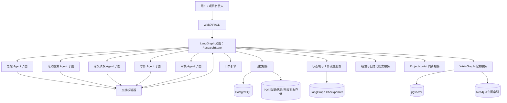
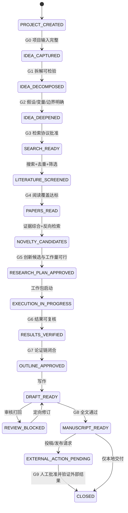
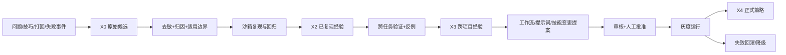

# AutoResearch 详细计划书

- 文档版本：`0.1.0-plan`
- 编制日期：2026-08-21
- 当前性质：架构与实施基线，不代表软件已经实现
- 项目治理事实源：[`../.project-to-act/`](../.project-to-act/)
- 功能范围与状态唯一清单：[`../.project-to-act/PROJECT_FEATURES.md`](../.project-to-act/PROJECT_FEATURES.md)

## 1. 项目定位

AutoResearch 是一套以 LangGraph 为运行时、以证据和门禁为约束、以论文项目文件夹为治理载体的多 Agent 研究系统。它覆盖从原始 idea 到“可复核的论文结果与稿件”的完整过程：

1. idea 接收、拆解与边界澄清；
2. idea 深化、假设形成与可证伪化；
3. 相关论文检索、去重、筛选与版本识别；
4. 论文读取、结构化总结、陪读与证据摘录；
5. 研究空白、冲突证据和创新候选挖掘；
6. 工作包拆分、实验/分析执行辅助与结果闭环；
7. 论文提纲、写作、修改、润色和引用校验；
8. 方法、证据、创新、结果、引用和交付完整性审核；
9. 问题、技巧、失败模式和可复用流程的分级沉淀。

其中，论文总结由论文读取 Agent 负责，论文写作由写作 Agent 负责；两者都必须消费已定位、已分级并通过相应 Gate 的证据。

本系统帮助用户完成研究工作，但不承诺 idea 必然新颖、实验必然成功、稿件必然录用，也不把模型生成内容当成真实实验结果。

## 2. 不可变架构约束

1. **恰好五个业务 Agent**：总控 Agent、论文搜索 Agent、论文读取 Agent、写作 Agent、审核 Agent。
2. 证据、门禁、状态机、交接、工作流、知识检索、自进化和项目管理是确定性服务或图节点，不另设隐藏业务 Agent。
3. 所有跨 Agent 交接都使用结构化 `HandoffEnvelope`；禁止转发完整聊天记录、完整 PDF 文本或无边界的“全部上下文”。
4. 所有关键结论必须绑定 `Claim -> Evidence`；没有定位信息的“参考文献”不能作为合格证据。
5. 高风险动作执行前，系统必须主动检索证据库、构建证据包、执行审核和门禁；LLM 无权自行绕过门禁。
6. 证据不足、工作未闭环、审核明确打回或需要人工批准而未批准时，不得进入下一级。
7. 自进化只生成提案；修改门禁策略、核心提示词、工作流、技能或长期经验等级必须经过验证与审批。
8. 论文库、经验库、知识库、用户画像库、项目库和证据库分区存储，不能把聊天记忆直接写成知识或经验。
9. 外部论文获取遵守许可与访问边界：优先元数据和开放获取全文；不得绕过付费墙或访问控制。
10. 对外投稿、发布、发送、删除、覆盖和高成本实验默认需要人工门禁。

## 3. 总体架构



### 3.1 运行时选择

- 父图使用 `StateGraph[ResearchState]` 控制论文生命周期。
- 五个 Agent 各自是可测试的 subgraph，默认按调用隔离，避免同一 Agent 的并行任务写入相同 checkpoint namespace。
- 开发环境可使用 SQLite checkpointer；正式环境使用 PostgreSQL 持久化 checkpointer。
- 人工审批、补充信息和明确打回使用 LangGraph `interrupt()`；恢复时使用同一 `thread_id` 和结构化 `Command(resume=...)`。
- LangGraph state 只保存状态字段与 artifact/evidence/handoff ID，不保存无限增长的原始消息堆。
- 任何位于 `interrupt()` 之前的副作用必须幂等；外部动作通过 idempotency key 和 outbox 执行。

LangGraph 官方将 checkpointer 用于线程级状态、人工介入、故障恢复和时间回放，将 Store 用于跨线程长期数据；这正好对应本项目的“项目运行状态”和“知识/画像/经验”两层。[Persistence](https://docs.langchain.com/oss/python/langgraph/persistence) · [Subgraphs](https://docs.langchain.com/oss/python/langgraph/use-subgraphs) · [Interrupts](https://docs.langchain.com/oss/python/langgraph/interrupts)

## 4. 五 Agent 定义

| Agent | 核心职责 | 允许输入 | 必须输出 | 明确禁止 |
|---|---|---|---|---|
| 总控 Agent | idea 拆解、idea 深化、研究范围、工作流选择、工作包拆分、进度协调、项目账本同步 | 用户目标、项目状态摘要、结构化交接结果、审核决定 | 研究章程、阶段计划、任务包、交接包、下一状态建议 | 代替搜索 Agent 做系统检索；代替读取 Agent 下创新结论；自批通过；伪造执行结果 |
| 论文搜索 Agent | 检索式生成、多源论文检索、去重、版本归并、初筛、开放全文定位、检索诊断 | 研究范围、纳排标准、时间/领域/语言边界 | 搜索日志、候选论文表、去重映射、召回缺口、全文可用性 | 深读论文后直接宣布创新；绕过付费墙；无日志地替换检索结果 |
| 论文读取 Agent | 全文结构解析、逐段陪读、结构化总结、证据摘录、跨论文综合、冲突识别、创新候选挖掘 | 论文 ID、合规全文、阅读问题、研究章程 | 阅读卡、claim-evidence map、比较矩阵、局限性、创新候选、开放问题 | 仅凭摘要生成全文结论；把创新候选写成已证明创新；修改原始论文证据 |
| 写作 Agent | 提纲、段落草稿、方法/实验/结果叙述、引用绑定、修改、语言润色、格式导出 | 已放行 claim、结果 artifact、引用索引、目标模板、审稿意见 | 提纲、稿件版本、修改说明、引用清单、未解决占位符 | 引入无证据数字；补造实验；为了流畅删除不确定性；引用未读取来源 |
| 审核 Agent | 范围、证据、方法、创新、结果、引用、复现、闭环和写作质量审核；执行打回建议 | 待审 artifact、证据包、验收标准、先前 Gate 决定 | 审核报告、问题等级、Gate 建议、回退目标、复验条件 | 直接改证据后自批；用风格判断替代事实审核；无理由放行 |

### 4.1 权力分离

- 产出者不能为自己的关键产出签发最终 Gate。
- 审核 Agent 给出审核结论，确定性 Gate Engine 根据策略计算最终状态。
- 总控 Agent 只能请求 Gate，不能覆盖 Gate。
- 人工批准只能由已认证的项目角色写入，不能由模型代填 `approved_by`。

## 5. 端到端状态机



### 5.1 状态转换不变量

每次转换必须同时满足：

1. 当前状态与期望前置状态一致；
2. 所需 artifact 存在且版本/hash 未变化；
3. HandoffEnvelope schema 校验通过；
4. 必需 claim 已绑定满足策略的证据包；
5. 阶段完成条件全部闭环；
6. 审核结论不是 `REJECT`；
7. Gate 结果为 `PASS`，或人工恢复结果满足 `INTERRUPT` 的条件；
8. 转换事件、证据包和 Gate 决定写入不可覆盖审计记录。

Gate 状态统一为：

- `PASS`：允许进入下一状态；
- `PASS_WITH_CONDITIONS`：只允许执行列明的可逆动作，遗留条件持续跟踪；
- `REVISE`：退回指定 Agent 和指定状态；
- `INTERRUPT`：暂停等待人工输入或批准；
- `DENY`：硬阻断，只有新增证据、策略变化或人工取消后才能重新评估；
- `CANCELLED`：项目负责人主动终止，保留全部审计历史。

## 6. 论文搜索与读取流程

### 6.1 搜索协议

搜索 Agent 的每次检索必须生成 `SearchRun`：

- 研究问题与检索版本；
- 数据源、检索式、过滤器、时间、页游标；
- 命中数、保留数、去重数、拒绝数与拒绝理由；
- DOI/OpenAlex/S2/arXiv/PMID 等规范化标识；
- 预印本、会议版、期刊版和撤稿/更正关系；
- 开放全文位置、访问许可与获取状态；
- 已知召回缺口和需要人工补充的数据库。

推荐连接器分工：

- OpenAlex：主召回、引文/作者/主题/机构关系图和 related works；其 Works API 支持搜索、过滤、排序和分页。[OpenAlex API](https://help.openalex.org/api/) · [List works](https://developers.openalex.org/api-reference/works/list-works)
- Crossref：DOI、出版类型、期刊、更新/更正和出版元数据核验。[Crossref REST API](https://www.crossref.org/documentation/retrieve-metadata/rest-api/)
- Semantic Scholar：引用、参考文献、相关论文、部分摘要/PDF URL 与领域补充。[Academic Graph API](https://www.semanticscholar.org/product/api)
- arXiv、PubMed/Europe PMC、用户提供数据库：按领域启用，不把单一索引的“未检出”解释为不存在。

### 6.2 论文读取子状态机

`QUEUED -> FULLTEXT_READY -> STRUCTURE_EXTRACTED -> SECTION_READING -> SUMMARY_DRAFT -> CLAIM_MAP_READY -> INNOVATION_SCAN -> REVIEWED -> PUBLISHED_TO_PAPER_LIBRARY`

论文读取 Agent 的标准阅读卡至少包含：

1. 规范引用、版本、访问许可与全文 hash；
2. 研究问题与作者主张；
3. 方法、数据集、基线、变量、评价指标；
4. 关键结果及精确页码/章节/表图定位；
5. 适用范围、假设、局限性和失败案例；
6. 可复现资源和缺失资源；
7. 与当前 idea 的支持、冲突、正交或不可比关系；
8. 作者声称的创新与读取 Agent 推断的创新候选分栏记录；
9. 未解决问题、需要补读的引用和置信度；
10. 审核状态与对应 evidence ID。

“论文阅读陪跑”采用章节级 checkpoint：用户可以对某个术语、公式、图表、实验设计或结论发问；回答只装配当前段落、必要的前置定义和被引用证据，不向 Agent 注入整篇聊天历史。

## 7. 创新点挖掘

创新点不是一次自由生成，而是论文读取 Agent 主导、搜索 Agent 反向检索、审核 Agent 最终把关的闭环：

1. 从论文图谱提取 `问题—方法—数据—约束—结果—局限` 六元组；
2. 建立现有工作的 capability/assumption/metric/setting 矩阵；
3. 寻找未覆盖组合、冲突结论、失效边界、评价盲区和复现缺口；
4. 形成创新候选：新增问题、机制、方法、数据、指标、系统、理论解释或负结果；
5. 为每个候选生成最强反例与否证检索式；
6. 搜索 Agent 做 prior-art 反向检索与近邻扩展；
7. 读取 Agent 比较最近似工作，输出区别特征和最小可证伪实验；
8. 审核 Agent 将候选标为 `SUPPORTED / PARTIAL / DUPLICATED / UNSUPPORTED / UNKNOWN`；
9. 只有 `SUPPORTED` 或明确边界内的 `PARTIAL` 可进入研究计划；对外仍称“创新候选”，直到实验和完整查新闭环。

每个创新候选必须记录：`candidate_id`、一句话主张、最近似工作、区别特征、价值、必要工作量、关键风险、最小实验、反证条件、证据包、审核状态。

## 8. 工作量辅助落实

总控 Agent 将获批研究计划拆为 `WorkPackage`，每个包包含：

- 目标和不做什么；
- 输入 artifact/evidence ID；
- 产出格式与验收测试；
- 数据、代码、算力、工具、预算和外部依赖；
- 风险等级、证据要求和人工审批点；
- 预计工作量区间及估计假设；
- 可并行关系、阻塞关系和回滚方案；
- 负责人、当前状态、失败重试上限与结束条件。

实验或分析执行必须生成 `RunManifest`：代码版本/hash、数据版本、环境、参数、随机种子、命令、开始/结束时间、退出状态、原始输出位置、指标和异常。模型不能把未运行的命令、模拟数据或推测结果写成真实结果。

## 9. 结构化交接系统

### 9.1 HandoffEnvelope

```yaml
schema_version: "1.0"
handoff_id: "ho_..."
project_id: "paper_..."
run_id: "run_..."
from_agent: "orchestrator|search|reader|writer|reviewer"
to_agent: "orchestrator|search|reader|writer|reviewer"
task_type: "..."
lifecycle_state: "..."
objective: "单一、可验收的目标"
input_refs:
  - artifact_id: "art_..."
    version: 3
    content_hash: "sha256:..."
    purpose: "为什么需要它"
claim_refs: ["claim_..."]
evidence_policy_id: "ep_..."
constraints: []
assumptions: []
expected_outputs: []
acceptance_checks: []
open_questions: []
risk_level: "L0|L1|L2|L3|L4"
return_to_state: "..."
created_at: "ISO-8601"
```

### 9.2 HandoffResult

返回结果只包含：产出 artifact ID、claim ID、evidence ID、完成检查、未解决问题、建议下一状态和失败分类。禁止把下列内容塞入交接：

- 完整历史对话；
- 整篇 PDF/网页正文；
- 未裁剪的工具日志；
- 与当前目标无关的所有项目文件；
- 没有版本/hash 的可变路径；
- 只写“请继续处理”的模糊任务。

默认上下文预算由 `ContextAssembler` 控制：项目章程摘要 1 份、当前任务 1 份、直接输入 artifact 不超过 12 个、每个证据只带摘要与 locator，全文按需二次读取。超限时 Gate 返回 `REVISE`，由总控 Agent 重新拆分任务。

## 10. 证据系统

### 10.1 证据对象

每条证据至少包含：

`evidence_id`、类型、等级、来源 URI、精确 locator、内容 hash、采集方式、原始 artifact ID、摘要、直接性、独立来源组、时效、许可、适用范围、支持/反驳的 claim、审核状态、创建者、创建时间、过期时间、撤回/替代关系。

证据不可覆盖修改。修订时创建新版本并用 `SUPERSEDES` 连接；撤稿、数据错误或人工否决使用 `INVALIDATES`，历史仍保留。

### 10.2 分类型等级

等级不是简单相加的“总分”，而是门禁策略可检查的成熟度标签。

| 类型 | 等级 | 含义 |
|---|---|---|
| 人工证据 H | H0 | 未确认的口头线索或临时备注 |
|  | H1 | 用户明确陈述，但尚未复核或固化 |
|  | H2 | 人工审阅的决定/标注，绑定版本化 artifact |
|  | H3 | 对高风险动作的实名批准或正式签核 |
| 论文证据 P | P0 | 只有题录/索引元数据 |
|  | P1 | 已核对摘要，尚未核对全文主张 |
|  | P2 | 已核对全文，主张绑定页/节/图/表定位 |
|  | P3 | 至少两个独立来源完成支持/冲突综合 |
|  | P4 | 系统综述、标准、权威基准或多源共识，并完成适用性审查 |
| 经验 X | X0 | 单次原始事件或未整理技巧 |
|  | X1 | 结构化经验候选，包含触发条件和失败边界 |
|  | X2 | 在沙箱中复现并有回归测试 |
|  | X3 | 跨任务/跨项目验证，含反例 |
|  | X4 | 人工批准成为正式策略/技能，且通过灰度验证 |
| 运行/实验 R | R0 | 推测、模型模拟或未执行计划，不能作为结果 |
|  | R1 | 单次可重放运行，环境/参数/输出齐全 |
|  | R2 | 重复运行或对照/消融完成，结果稳定性可检查 |
|  | R3 | 独立复核或不同环境复现 |
|  | R4 | 发布级复现包、数据说明和审计通过 |

### 10.3 证据包

Gate 不直接查询“证据条数”，而检查 `EvidenceBundle`：

- 与目标 claim/action 的相关性；
- 是否存在全文级或运行级直接证据；
- 独立来源数量，避免同一论文不同镜像被重复计数；
- 是否完成反证/撤稿/更正检索；
- 时效与版本是否仍有效；
- 来源许可与项目可见范围；
- 是否包含冲突证据及其处理结论；
- 是否满足当前领域策略和人工审批条件。

## 11. 门禁系统

| 风险级别 | 代表操作 | 最低证据策略 | 人工要求 | 默认失败行为 |
|---|---|---|---|---|
| L0 | idea 发散、只读浏览、生成检索式 | 可无证据，但输出必须标为假设/候选 | 无 | 允许，禁止形成事实结论 |
| L1 | 元数据检索、本地可逆草稿、阅读队列调整 | 来源可追溯；至少 P0/H1/X1 之一 | 通常无 | `REVISE` 补 provenance |
| L2 | 全文总结、研究计划、低成本实验、局部代码修改 | P2 或 H2/X2；关键 claim 有 locator；审核通过 | 按资源阈值 | `REVISE` 或 `INTERRUPT` |
| L3 | 宣称创新、写入正式知识/经验、采纳结果结论、中高成本实验 | 两个独立 P2 或 P3；反向检索；结果需 R1/R2；冲突已处理 | 知识晋级/高成本需批准 | `INTERRUPT`，证据不足则 `DENY` |
| L4 | 投稿/发布/发送、删除覆盖、敏感数据、修改门禁/核心技能、不可逆或高成本操作 | H3 + 适用的 P3/R2 以上证据包 + 闭环验证 + 回滚/备份 | 必须 | `DENY`，不得自动降级 |

永久硬阻断：伪造论文、引用、实验、用户批准或工具结果；绕过付费墙；超出授权访问数据；未经确认对外投稿/发布；无备份删除原始研究资产。

危险操作前固定执行：`action_classify -> evidence_retrieve -> bundle_build -> evidence_audit -> gate_evaluate -> optional_interrupt -> idempotent_execute -> verify -> ledger_append`。

## 12. Wiki+Graph 知识体系

### 12.1 分库边界

| 分区 | 存储内容 | 可写入来源 | 默认召回优先级 |
|---|---|---|---|
| 证据库 | 原始证据元数据、locator、hash、claim 绑定、Gate 记录 | 证据服务；append-only | 最高，危险操作强制先查 |
| 项目库 | 研究章程、任务、决策、artifact、实验运行和当前论文状态 | 项目工作流 | 当前项目最高 |
| 论文库 | 题录、全文索引、阅读卡、claim、方法、数据、结果、限制、引用关系 | 搜索/读取流程，经审核发布 | 事实论证优先 |
| 经验库 | 问题、技巧、触发条件、适用边界、反例、验证次数和等级 | 自进化提案，经审核晋级 | 流程决策次于证据 |
| 知识库 | 概念、定义、公式、标准、协议、领域 Wiki 页和人工知识 | 人工录入或证据沉淀提案 | 背景解释与概念对齐 |
| 用户画像库 | 研究方向、能力、写作偏好、资源限制、目标期刊和已确认习惯 | 用户明确输入或确认后的推断 | 仅本用户/本项目范围 |

短期会话 state、长期经验和领域知识严格分离：聊天中出现一次的内容不能自动晋级为经验或知识。

### 12.2 Wiki 层

- 每个主题、论文、方法、数据集、指标、经验和项目决策都有可读 Wiki 页。
- Wiki 页使用不可覆盖 revision，带作者、来源、证据包、审核状态和生效时间。
- 论文提炼后先进入 `paper/draft`，审核通过才进入 `paper/published`。
- 经验先进入 `experience/candidate`，满足晋级条件后进入对应等级。
- 知识页可以引用论文页和证据，但不能复制无许可的整篇全文。

### 12.3 Graph 层

主要节点：`Project`、`Idea`、`Hypothesis`、`Paper`、`Claim`、`Method`、`Dataset`、`Metric`、`Result`、`Limitation`、`Concept`、`Experiment`、`Artifact`、`Evidence`、`Experience`、`Decision`、`UserPreference`。

主要边：`CITES`、`SUPPORTS`、`CONTRADICTS`、`EXTENDS`、`DUPLICATES`、`USES_METHOD`、`USES_DATASET`、`EVALUATES_ON`、`IMPROVES`、`HAS_LIMITATION`、`DERIVED_FROM`、`APPLIES_TO`、`INVALIDATES`、`SUPERSEDES`、`CREATED_IN`、`PREFERS`。

PostgreSQL 保存规范对象和 Wiki revision；Neo4j 是通过 outbox 生成的派生图索引。图索引可重建，不能反向覆盖规范数据。文本语义索引使用 pgvector，关键词检索使用 PostgreSQL FTS。PDF、数据、代码、图表和大日志存对象存储，仅在数据库保存 hash、URI 和许可。

## 13. 分级召回与检索

1. **L0 权限与范围过滤**：project/user/visibility/license/validity；
2. **L1 精确召回**：DOI、OpenAlex ID、artifact ID、claim ID、hash、标题精确匹配；
3. **L2 词法与元数据召回**：BM25/FTS、作者、年份、venue、方法、数据集、标签；
4. **L3 语义召回**：按库独立向量检索，禁止把所有分区混成一个索引；
5. **L4 图扩展**：一至两跳引用、支持/冲突、方法/数据/指标邻域；
6. **L5 融合与重排**：RRF 合并后用 reranker 处理，保留每个候选的分数分解；
7. **L6 证据过滤**：按当前操作所需类型、等级、时效和独立性过滤；
8. **L7 ContextPack**：只输出任务所需摘要、locator 和 artifact refs；
9. **L8 召回审计**：保存查询、过滤器、候选、去重、重排和最终引用，供离线评测。

默认顺序是“项目已确认事实/人工决定 -> 合格证据 -> 论文库 -> 经验库 -> 知识库 -> 外部检索”。写作 Agent 只能消费已审核 claim；经验只能帮助选择流程，不能替代论文或实验事实。

## 14. 用户画像

用户画像分三层：

- `explicit`：用户直接给出的方向、背景、偏好、工具、语言、目标 venue、预算和禁区；
- `inferred`：系统推断，带置信度、来源和有效期，不能作为高风险 Gate 的人工证据；
- `confirmed`：用户确认后的画像项，可作为 H2 使用。

画像按字段最小化存储，可查看、修改、停用和删除；敏感信息默认不进入 embedding。召回时先按项目作用域过滤，再按任务选择“研究能力、写作偏好、资源约束或交互节奏”等必要字段。

## 15. 自进化与经验沉淀



自进化来源包括：Gate 打回、证据缺口、检索漏召回、引用错误、摘要遗漏、实验失败、重复人工修正、优秀工作包和高质量审稿意见。每条经验必须同时保存“什么时候适用”和“什么时候不适用”。

受保护资产包括门禁策略、证据等级、Agent 权限、外部动作权限、用户隐私策略、核心工作流和项目验收标准。模型只能提交 diff 提案，不能直接生效。每次晋级或降级都必须有回归集、证据 ID、审核结论、版本和回滚点。

## 16. 论文项目文件夹与 Project-to-Act

仓库根 `.project-to-act` 管理 AutoResearch 平台建设；每个真实论文项目位于 `paper-projects/<project-id>-<slug>/`，并拥有自己的 `.project-to-act`，该子目录是独立项目根。

```text
paper-projects/<project-id>-<slug>/
├─ .project-to-act/          # 目标、进度、功能、版本、验收唯一治理账本
├─ PROJECT_MANIFEST.yaml     # 机器可读 ID、路径和数据库引用
├─ 00_intake/                # 原始 idea、用户输入、边界
├─ 01_scope/                 # 研究章程、假设、评价标准
├─ 02_literature/            # 检索协议、筛选表、阅读队列
├─ 03_innovation/            # 创新候选、最近似工作、反证结果
├─ 04_execution/             # 工作包、代码/数据引用、运行清单、结果
├─ 05_writing/               # 提纲、稿件、图表、参考文献
├─ 06_review/                # 审核意见、修改记录、Gate 决定
├─ 07_delivery/              # 本地交付与复现包
├─ evidence/                 # 证据清单/包；大文件只放受控引用
├─ handoffs/                 # 结构化交接 envelope/result
├─ state/                    # 可读状态投影，不替代 LangGraph checkpoint
└─ knowledge-links/          # 指向论文/经验/知识库的稳定 ID
```

避免双重事实源：

- `.project-to-act` 是目标、范围、里程碑、功能状态、版本和验收结论的规范来源；
- LangGraph checkpoint 是节点级运行状态的规范来源；
- Evidence Ledger 是证据与 Gate 历史的规范来源；
- 文件夹内 `state/`、看板和 UI 都是只读投影，不反向覆盖上述规范来源；
- 只有有效里程碑变化才同步 `.project-to-act`，不把每个 token/工具事件写入账本。

本仓库已提供 [`../paper-projects/_template/`](../paper-projects/_template/) 作为论文项目种子。

## 17. 服务与数据组件

| 组件 | 建议实现 | 职责 |
|---|---|---|
| API | FastAPI + Pydantic | 项目、运行、恢复、Gate、搜索、阅读、写作、审核接口 |
| 编排 | LangGraph | 父图、五 Agent 子图、条件边、checkpoint、interrupt |
| 事务库 | PostgreSQL | 项目、任务、Wiki revision、claim、evidence、profile、outbox |
| 向量 | pgvector | 论文/知识/经验/项目分区 embedding 与语义检索 |
| 图索引 | Neo4j | 引用、支持/冲突、方法/数据/指标和创新邻域查询 |
| 大对象 | 本地受控存储或 S3/MinIO | PDF、数据、代码快照、图表、运行输出 |
| 引用 | CSL JSON + BibTeX | DOI 规范化、引用样式、稿件引用一致性 |
| 观测 | 结构化事件 + OpenTelemetry 适配 | run/node/tool/gate/evidence/handoff 追踪 |
| 评测 | pytest + 固定 gold corpus | 召回、摘要、引用、门禁、恢复、创新误报和写作回归 |

模型服务通过 provider adapter 接入，密钥只来自环境或安全配置；项目文件、日志和证据中不得写入 API key。

## 18. 接口边界

首版 API 建议：

- `POST /projects`：创建论文项目并实例化 Project-to-Act 文件夹；
- `POST /projects/{id}/runs`：从指定生命周期状态启动；
- `POST /threads/{thread_id}/resume`：恢复 interrupt；
- `GET /projects/{id}/state`：读取状态投影；
- `POST /papers/search`、`GET /search-runs/{id}`：检索与审计；
- `POST /papers/{id}/read`、`GET /reading-cards/{id}`：阅读与陪跑；
- `POST /handoffs`、`GET /handoffs/{id}`：结构化交接；
- `POST /gates/{id}/review`、`POST /gates/{id}/approve`：审核与人工批准；
- `POST /knowledge/search`：分库、分级检索；
- `POST /claims/{id}/evidence-bundles`：构建证据包；
- `POST /evolution/proposals`、`POST /evolution/proposals/{id}/promote`：经验与自进化；
- `POST /manuscripts/{id}/versions`、`POST /manuscripts/{id}/review`：稿件版本与审核。

## 19. 实施阶段

以下周期是假设 2 名后端/Agent 工程师和 1 名检索/前端工程师部分投入的工程估计，不是交付承诺。

| 阶段 | 预计 | 核心产出 | 退出 Gate |
|---|---:|---|---|
| P0 规划基线 | 已完成本轮 | 计划书、功能表、Project-to-Act、论文项目模板、现有底座差距 | 文档/账本验证通过 |
| P1 合同与最小父图 | 2–3 周 | ResearchState、五 Agent 壳、handoff/evidence/gate schema、Postgres checkpointer | 恢复、打回、无上下文堆砌测试通过 |
| P2 搜索与论文读取 | 3–4 周 | 多源检索、去重、全文管线、阅读卡、陪读、论文库 | gold query 召回与引用定位达标 |
| P3 创新与工作执行 | 3–4 周 | 差距矩阵、反向检索、工作包、RunManifest、结果验证 | 创新误报与伪结果测试通过 |
| P4 写作与审核 | 2–3 周 | 提纲/稿件版本、claim-citation、审稿闭环、格式导出 | 关键 claim 证据绑定 100% |
| P5 Wiki+Graph、画像、自进化 | 3–4 周 | 分库检索、图投影、画像确认、经验晋级/降级、回归集 | 分区隔离与策略变更门禁通过 |
| P6 集成与 v1.0 | 2–3 周 | UI/API、迁移、备份、性能/安全/恢复测试、操作手册 | `PROJECT_ACCEPTANCE.md` 全部通过 |

## 20. 验收指标

1. 五个业务 Agent 数量和职责符合本计划，系统服务不冒充第六个 Agent。
2. 所有跨 Agent 交接 100% 通过 schema，完整聊天/PDF 不出现在 envelope。
3. 高风险 Gate 绕过率为 0；证据不足、工作未闭环、明确打回均不能前进。
4. 稿件中所有关键事实、数字、方法和结果 claim 100% 绑定有效 evidence ID。
5. 被撤稿/更正/失效证据能阻止旧结论继续放行。
6. 搜索 gold set 建立后，目标 `Recall@20 >= 0.85`；若领域数据库不可访问，必须标记 blocked/unknown，不能伪造命中。
7. DOI/版本去重准确率、全文 locator 有效率、引用解析成功率分别建立可复查报表。
8. 论文摘要与原文主张一致性由固定样本人工盲审；不合格样本进入回归集。
9. 同一 checkpoint 恢复不重复执行外部副作用。
10. 经验 X2 以上均有复现证据，X4 均有人工批准、灰度结果和回滚点。
11. paper/experience/knowledge/user/project/evidence 分区权限与检索过滤测试通过。
12. 从新建项目到本地稿件交付完成一次真实端到端试点，并保留完整 evidence/gate/handoff/run 记录。

## 21. 现有 DeepReason 框架复用判断

2026-08-21 对嵌套仓库 `DeepReason-Agents-Framework` 的 28 项相关测试已通过，证明其证据 hash/ledger、基础 Gate、轻量混合/图检索、分区记忆、自进化提案和 workflow spec 可以作为参考底座。它不能直接视为本项目完成，原因是：

- 内置 AutoResearch 模板包含 14 个 Agent，不符合严格五 Agent 约束；
- LangGraph 只是可选依赖，不是当前唯一主运行时；
- Gate 主要按证据数量判断，缺少类型/等级/独立性/时效/冲突/闭环策略；
- 现有图检索是轻量文本共现评分，不是版本化 Wiki+属性图系统；
- 缺少论文全文结构、阅读陪跑、创新反检索、RunManifest、稿件 claim-citation 和论文项目实例化闭环。

建议复用其测试思想、append-only/proposal-only 原则和部分领域模型，不原样继承 14 Agent 拓扑。

## 22. 主要风险与缓解

| 风险 | 缓解 |
|---|---|
| 检索覆盖不全导致虚假创新 | 多源检索、反向检索、人工数据库补充入口、UNKNOWN 状态 |
| 摘要替代全文 | P1 不能支持全文级 claim；需要 P2 locator |
| 多 Agent 上下文膨胀 | ID 引用、ContextPack、schema 限额、父图统一调度 |
| checkpoint 恢复重复副作用 | 幂等键、outbox、先记录意图后执行、执行后校验 |
| 图/向量/事务库不一致 | PostgreSQL 规范源、outbox 投影、可重建索引、版本水位 |
| 经验污染知识 | 分库、晋级、反例、有效期、审核与降级 |
| 写作流畅但事实错误 | writer 只消费放行 claim，reviewer 做引用和结果审计 |
| 自动化越权 | L3/L4 interrupt、最小权限、审计、人工批准、硬阻断列表 |
| 论文版权与隐私 | OA/用户授权全文、locator/摘要最小化、ACL、删除与导出能力 |

## 23. 首个实施切片

第一开发切片只做一条可验收纵向链：

`创建论文项目 -> idea 拆解 -> OpenAlex/Crossref 检索 -> 选择 3 篇合规全文 -> 阅读卡 -> 一个创新候选 -> 审核打回/放行 -> 最小工作包 -> 一段带证据引用的相关工作草稿 -> 项目账本同步`。

该切片必须先证明状态恢复、结构化交接、证据不足阻断和人工打回可用，再扩展完整 UI、更多数据库和自进化。

## 24. 0.1.0 Foundation 落地状态（2026-08-22）

首个可运行基础切片已经落地：严格五 Agent、LangGraph 父图/子图、SQLite checkpoint、结构化 handoff、EvidenceItem、L0–L4 Gate、Wiki+Graph 分区、项目模板实例化、论文检索连接器、阅读卡/陪读、创新候选、工作包、证据限定稿件、审核打回、L4 interrupt/resume、画像、经验和 proposal-only 自进化均有代码入口。

该状态只表示基础架构和纵向功能完整，不替代本计划书中生产级完成条件。外部检索质量、真实全文语料、真实实验、PostgreSQL/pgvector/Neo4j、分布式幂等、Web UI、备份恢复和真实论文试点仍按功能账本推进。当前实现映射与边界见 `FUNCTION_MATRIX.md`，测试边界见 `TESTING.md`。
