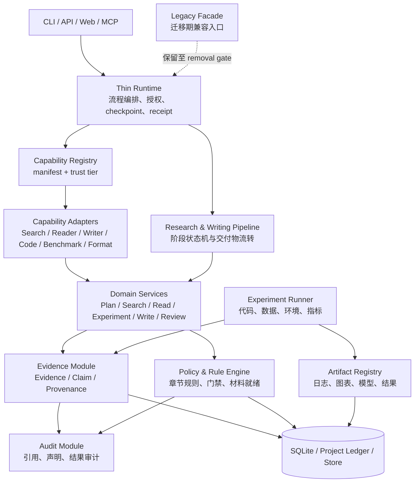

# AutoResearch Architecture V2（团队讨论草案）

> 状态：`draft / non-authoritative`（2026-09-04）
>
> 用途：综合 R-004 全项目重构计划、R-005 S1 收口设计以及团队提出的“论文生成 Agent + 实验材料/基准测试 pipeline”方向。
>
> 本文不替换 R-004，也不授权实现。R-004 仍是当前目标架构权威；本文用于团队反馈和下一次负责人决策。

## 1. 重新定义目标

做成一条**可配置、可追溯、可验证的论文研究与写作流水线**：

```text
研究问题
  → 研究计划
  → 证据收集与阅读
  → 论文结构与章节规则
  → 实验 / benchmark 计划
  → 实验执行与材料检查
  → 章节生成
  → 章节规则验证
  → 引用与 claim 审计
  → 可修改的论文工作包
```

首要用户场景可优先选择：

- 本科/研究生课程设计报告；
- 本科毕业论文；
- 研究生课程论文、开题和实验报告。

期刊论文、会议论文和更复杂的科研流水线作为可配置的后续场景，不是第一阶段的质量承诺。

## 2. L1：总体架构



### L1 责任边界

| 子系统 | 负责 | 不负责 |
|---|---|---|
| Thin Runtime | 编排阶段、授权、run/checkpoint、调用收据 | 搜索算法、写证据、做最终判断 |
| Capability Registry | 能力身份、版本、权限、trust tier | 执行能力、证明结果正确 |
| Capability Adapter | 调用外部工具、typed transfer、幂等、显式失败 | 直接写 Evidence、直接做 GateDecision |
| Pipeline | 阶段顺序、交付物状态、阶段门禁 | 代替各领域模块处理业务细节 |
| Domain Services | 研究计划、搜索、阅读、实验、写作、审阅 | 跨模块越权写状态 |
| Evidence Module | 事实、来源、claim linkage、provenance | 生成论文 prose、做政策判断 |
| Policy & Rule Engine | 规则判断、章节检查、材料就绪、promotion gate | 创造事实 |
| Experiment Runner | 执行代码/数据/指标并记录原始结果 | 把未执行结果写成结论 |
| Audit Module | 引用、声明、结果、撤稿和一致性审计 | 直接写 EvidenceItem、直接改 GateDecision |
| Store / Ledger | 持久化和项目投影 | 决定业务语义 |

## 3. L2：模块间协议

所有跨边界通信只使用四种形式：

```text
Command       请求某个动作
Typed Transfer 传递结构化结果
Query / View   读取有界视图
Receipt / Evidence 传递执行收据或证据事实
```

### L2-A：Pipeline Stage Contract

每个 pipeline 阶段都是一个有边界的 stage：

```text
StageInput → StageExecution → StageOutput + StageReceipt
```

Stage 必须声明：

- 输入 artifact 和前置 stage；
- 输出 artifact 类型；
- 必需 capability；
- 需要的 evidence；
- 允许的状态转换；
- 失败和恢复方式；
- 是否允许进入下一阶段。

阶段状态建议统一为：

```text
blocked → ready → running → produced → verified → accepted
                         └→ failed / unknown / needs_material
```

### L2-B：Capability Invocation Contract

```text
InvocationRequest
  = project_id + run_id + invocation_id
  + capability_version + bounded_input

InvocationResult
  = typed_output + diagnostics
  + InvocationReceipt + EvidenceCandidate[]
```

规则：

- reserve 必须先于外部副作用；
- 相同 invocation + 相同 fingerprint 必须精确 replay；
- 冲突 replay 必须拒绝；
- timeout、provider error、parse error、unknown 必须显式返回；
- adapter 不能直接写正式 Evidence 状态。

### L2-C：Evidence Admission Contract

```text
EvidenceCandidate
  → Evidence Admission
  → EvidenceItem / ClaimLink / ArtifactLink
```

Evidence Admission 负责：

- 来源是否存在；
- locator 是否有效；
- candidate 是否重复；
- 是否与已有事实冲突；
- 是否可以被某个 claim 使用；
- 是否只能作为低信任候选。

唯一写入者仍然是 Evidence Module。

### L2-D：Manuscript Section Contract

每个章节不是普通字符串，而是一个可验证对象：

```text
SectionDraft {
  section_id
  section_type
  audience
  style_profile
  claims[]
  citations[]
  evidence_refs[]
  experiment_refs[]
  unresolved_items[]
  validation_status
}
```

Writer 负责生成草稿；Rule Engine 负责验证：

- 章节是否存在；
- 必需字段是否齐全；
- 字数、结构、格式和语气是否符合 profile；
- claim 是否有证据；
- 数字是否有实验结果；
- 是否加入了未经授权的新 claim；
- 未验证内容是否被明确标注。

### L2-E：Material Readiness Contract

```text
MaterialReadinessRequest
  = paper_type + target_section + experiment_plan + project_state

MaterialReadinessResult
  = ready | needs_material | blocked
  + required_materials[]
  + optional_materials[]
  + missing_evidence[]
  + blocking_reasons[]
```

它检查的不是“文字像不像论文”，而是写作或实验是否有足够材料：

- 数据集；
- baseline；
- 代码和版本；
- 运行环境；
- 指标定义；
- 原始结果；
- 图表；
- 引用和 locator；
- 失败记录和限制。

### L2-F：Experiment / Benchmark Contract

Benchmark Advisor 输出的是建议，不是事实结论：

```text
BenchmarkRequest
  = research_question + method + dataset
  + target_claims + available_resources

BenchmarkPlan
  = benchmark_candidates[]
  + baselines[]
  + metrics[]
  + required_materials[]
  + risks[]
  + unsupported_claims[]
```

只有 Experiment Runner 实际执行后，才可以产生：

```text
RunManifest + RawOutputs + Metrics + ExperimentArtifact
```

未执行的 benchmark 只能标记为 `planned`，不能被写成实验结果。

### L2-G：Audit / Promotion Contract

Audit 输入稿件、claims、引用和实验 artifact，输出：

```text
AuditReport
AuditVerdict[]
EvidenceCandidate[]
PromotionDecision
```

审计结果可以是：

```text
pass / fail / unknown / needs_review
```

`unknown` 必须保留为未知，不能自动降级成 pass。

## 4. 具体论文生成管线

### Stage 0：项目受理

输入：

- 用户目标；
- 论文类型；
- 学校/venue 模板；
- 截止时间；
- 可用工具和资源。

输出：`ProjectBrief`、`WritingProfile`、`ConstraintSet`。

门禁：信息不足时进入 `needs_material`，不直接生成论文。

### Stage 1：研究问题与计划

流程：

```text
用户想法
  → 研究问题
  → 目标/假设
  → 任务分解
  → 预期证据和实验
```

输出：`ResearchPlan`、初始 claim 列表、风险列表。

门禁：研究问题、目标和范围必须明确；推测不能冒充结论。

### Stage 2：文献检索与筛选

流程：

```text
ResearchPlan
  → Search Capability
  → PaperRecord
  → 去重/筛选
  → ReadingQueue
```

输出：带来源和定位的论文记录。

门禁：来源、检索条件和筛选理由可追溯。

### Stage 3：阅读与证据抽取

流程：

```text
PaperRecord
  → Reader Capability
  → ReadingCard
  → Claim / Method / Dataset / Result
  → Evidence Admission
```

输出：`EvidenceBundle`、`ClaimEvidenceMap`、冲突和未知项。

门禁：没有 locator 的关键事实不能作为高等级证据。

### Stage 4：论文结构与章节计划

流程：

```text
PaperType + WritingProfile + EvidenceBundle
  → Outline Planner
  → SectionPlan[]
```

每个章节计划要列出：

- 章节目标；
- 必须回答的问题；
- 允许使用的 claim；
- 需要的 evidence；
- 需要的 experiment artifact；
- 当前缺口。

### Stage 5：实验和 benchmark 计划

流程：

```text
Claims + Method + Dataset + Resources
  → Benchmark Advisor
  → BenchmarkPlan
  → Material Readiness Checker
```

输出：

- 推荐 benchmark；
- 推荐 baseline；
- 推荐指标；
- 所需数据/代码/环境；
- 尚不能声称的结论。

门禁：缺关键材料时，相关章节进入 `blocked` 或 `needs_material`。

### Stage 6：实验执行

流程：

```text
BenchmarkPlan
  → Experiment Runner
  → RunManifest
  → RawOutputs
  → Metrics / Figures / Tables
  → Artifact Registry
```

规则：

- 命令、代码版本、数据版本、环境、参数和随机种子必须记录；
- 失败结果也必须保存；
- 未运行的实验不能写成已完成；
- 结果 artifact 必须可关联到 claim。

### Stage 7：章节生成

流程：

```text
SectionPlan
  + EvidenceBundle
  + ExperimentArtifacts
  + WritingProfile
  → Writer Agent
  → SectionDraft
```

Writer 可以生成 prose，但不能：

- 自己新增未经证据支持的数字；
- 改变 evidence strength；
- 把 planned 结果写成 observed 结果；
- 删除 unknown、failure 或 limitation。

### Stage 8：章节规则验证

流程：

```text
SectionDraft
  → Rule Engine
  → SectionValidationReport
```

检查：

- 结构；
- 风格和格式；
- claim-evidence 覆盖；
- 引用存在性；
- 实验结果绑定；
- 未验证声明；
- 禁止新增内容。

结果：

```text
verified / revise / blocked
```

### Stage 9：整稿组装与审计

流程：

```text
Verified Sections
  → Manuscript Assembler
  → Whole-Manuscript Audit
  → Release Readiness Report
```

输出：

- 论文工作稿；
- claim-evidence map；
- 实验材料清单；
- benchmark 计划和实际结果；
- 引用与声明审计报告；
- 未解决问题和限制。

## 5. 阶段状态和人机协作

每个阶段都保留人可以理解的状态：

```text
未开始 → 可开始 → 执行中 → 已产出 → 已验证 → 已接纳
                         ├→ 失败
                         ├→ 未知
                         └→ 缺材料
```

Agent 负责：

- 组织信息；
- 提出候选；
- 生成草稿；
- 执行工具；
- 报告风险和缺口。

人负责：

- 确认研究目标；
- 选择或否决重要方案；
- 批准高风险 claim；
- 处理冲突证据；
- 决定是否发布或提交。

## 6. 实施顺序建议

### 技术验证切片

继续完成 R005 的 Paper Search：验证 Capability、Evidence admission、幂等、parity 和 recovery。

### 第一条产品切片

在 S1 基础上选择一条用户可见流程，推荐：

```text
一个论文类型
  + 一个章节（优先 Evaluation 或 Related Work）
  + 一个 benchmark 计划
  + 一个材料缺口检查
  + 一次章节规则验证
```

这比直接承诺“整篇论文 Agent”更容易验收，但已经能证明产品价值。

### 后续扩展

```text
S1 Paper Search
  → S2 Evidence / Audit
  → S3 Reader / Writer + Rule Validator
  → S4 Experiment / Benchmark Pipeline
  → End-to-end Paper Workflow
```

## 7. 当前实现与目标差距

当前已有部分基础：

- Search、Reader、Writer、Evidence、Gate、Storage 等服务；
- 部分 claim/evidence 数据结构；
- Paper Search adapter 和幂等测试；
- 基础稿件 section 组装和受约束修订。

当前尚缺或未形成完整闭环：

- Writing Rule Validator；
- Material Readiness Checker；
- Benchmark Advisor / registry；
- 完整 Pipeline Orchestrator；
- Experiment artifact lineage；
- Audit Module 的可执行实现；
- 从研究问题到整稿的端到端验收。

## 8. 待负责人和团队决定

1. 首个用户产品切片是 `Evaluation Section`、`Related Work` 还是“课程设计报告”。
2. 论文类型和 WritingProfile 的第一版支持范围。
3. Benchmark Advisor 只推荐计划，还是也负责编排执行。
4. Material Readiness Checker 的阻断级别。
5. Chapter Rule Validator 的规则来源：学校模板、venue 模板、Skill 还是项目配置。
6. R005 Paper Search 是否继续作为技术先行切片。

这些问题应先进入 `DECISION-BOARD.md`，在团队反馈后再回写 R004 或形成新的正式设计增量。
